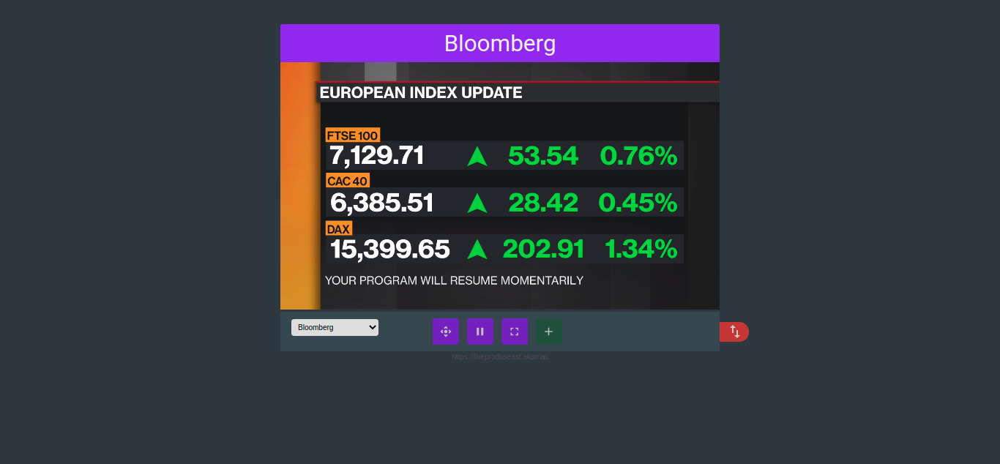

# WebTV
Web app para assistir alguns canais como TV Cultura, Globo, Band, Sbt etc..

## Bibliotecas ultilizadas
- [HLS.js](https://github.com/video-dev/hls.js/)
- [SweetAlert 2](https://github.com/sweetalert2/sweetalert2)

## Preview

## Canais disponiveis
- globo
- globo hd
- band
- sbt
- tcm
- cartoon network
- rdc
- agro brasil
- redetv
- tv cultura
- bloomberg
- record
- tve
- nickelodeon
- dazn 1
- dazn 2
- canal ricos
- canção nova
- fm o dia
- in paradise
- novo tempo
- animal planet
- cartoon network 2
- a e e
- discovery channel
- discovery home e health
- band sports
- discovery kids
- telecine premium
- sexy kpop tv
- music top
- e!
- e! hd
- espn
- fox
- fox hd
- fox sports
- gloob
- gloobinho
- gnt
- hbo
- megapix
- natgeo kids
- natgeo wild
- premiere
- sport tv
- syfy
- syfy hd
- history channel
- history channel
- boomerang"
- boomerang hd
- master tv
    